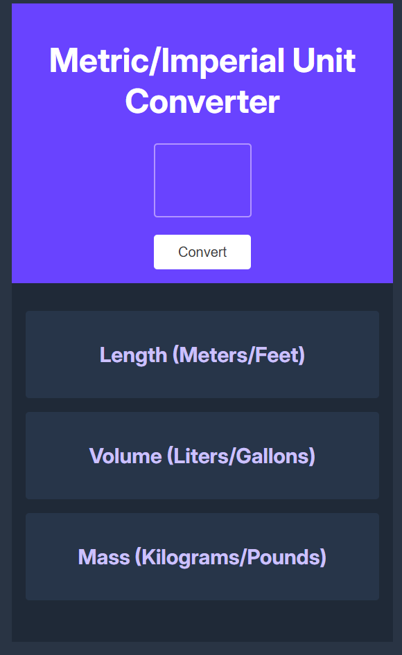

# Metric/Imperial Unit Converter

A browser-based tool that converts between metric and imperial units across three categories: length, volume, and mass.

---

## What It Does

Enter any number and click **Convert** to instantly see conversions for:

- **Length** — Meters ↔ Feet
- **Volume** — Liters ↔ Gallons
- **Mass** — Kilograms ↔ Pounds

---

## Skills Showcased

- DOM Manipulation
- Event Handling
- Data Type Handling
- Mathematical Logic
- String Interpolation (Template Literals)
- Number Formatting
- JavaScript Best Practices
- UI/UX Layout

## Tech Stack

- HTML
- CSS
- JavaScript